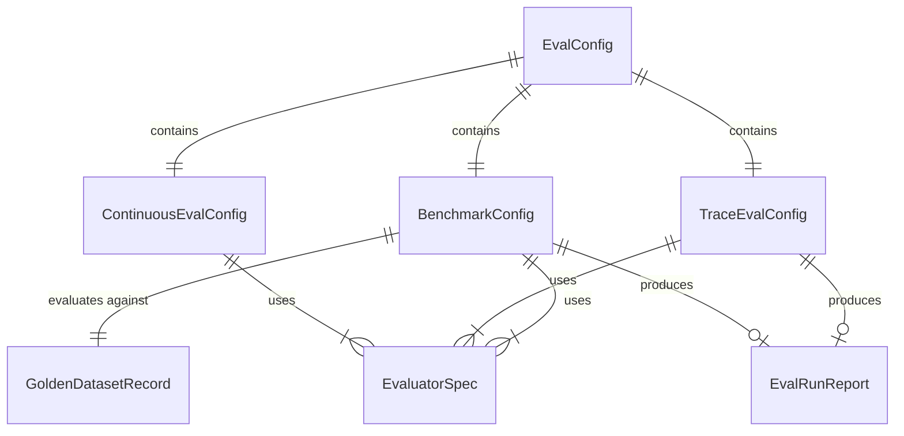

# Data Model: Foundry-Native Multi-Layer Evaluations

**Feature**: 008-foundry-native-evaluations
**Date**: 2026-05-25
**Source**: spec.md, research.md

## Entities

### 1. ContinuousEvalConfig

Configuration for the continuous evaluation rule (Layer 1).

| Field | Type | Constraints | Description |
|-------|------|-------------|-------------|
| rule_id | str | Non-empty, slug format | Stable identifier for idempotent create/update |
| agent_name | str | Non-empty | Foundry-registered agent name to filter on |
| evaluators | dict[str, EvaluatorSpec] | At least 1 safety + 1 quality | Evaluators to apply |
| max_hourly_runs | int | 1-1000, default 100 | Sampling cap per hour |
| enabled | bool | default True | Whether the rule is active |

**Relationships**: Referenced by `setup` CLI subcommand. Maps to a single Foundry `EvaluationRule` resource.

---

### 2. EvaluatorSpec

Reference to an evaluator (built-in or custom).

| Field | Type | Constraints | Description |
|-------|------|-------------|-------------|
| id | str | `builtin.*` format | Foundry evaluator identifier |
| init_params | dict[str, Any] | None | Optional initialization parameters (thresholds, etc.) |

---

### 3. BenchmarkConfig

Configuration for golden dataset benchmark evaluation (Layer 2).

| Field | Type | Constraints | Description |
|-------|------|-------------|-------------|
| evaluation_id | str | Non-empty | Target evaluation name in Foundry portal |
| agent_name | str | Non-empty | Registered agent name |
| agent_version | str | Non-empty | Agent version for target |
| dataset_id | str | Non-empty | Foundry dataset identifier |
| dataset_version | str | Non-empty | Dataset version to use |
| evaluators | dict[str, EvaluatorSpec] | At least 1 | Evaluator set |
| data_mappings | dict[str, str] | Required keys: query, response | Field mappings |

**Relationships**: Uses golden dataset (uploaded via `dataset upload`). Produces `EvalRunReport`.

---

### 4. TraceEvalConfig

Configuration for trace-based evaluation (Layer 3).

| Field | Type | Constraints | Description |
|-------|------|-------------|-------------|
| evaluation_id | str | Non-empty | Target evaluation name in Foundry portal |
| agent_id | str | Format: `name:version` | Agent ID for trace filtering |
| lookback_window | str | ISO 8601 duration, default "PT24H" | Trace lookback period |
| trace_ids | list[str] \| None | Optional, overrides agent filter | Explicit trace IDs |
| evaluators | dict[str, EvaluatorSpec] | At least 1 | Evaluator set |
| max_traces | int | 1-1000, default 200 | Maximum traces to evaluate |

**Relationships**: Uses Application Insights traces. Produces `EvalRunReport`.

**State Transitions**:
- `pending` → `submitted` (run created in Foundry)
- `submitted` → `completed` (Foundry reports completion)
- `submitted` → `failed` (submission-level failure)

---

### 5. GoldenDatasetRecord

Single row in the golden benchmark dataset.

| Field | Type | Constraints | Description |
|-------|------|-------------|-------------|
| query | str | Non-empty | Natural language question |
| ground_truth | str | Non-empty | Expected behavior/answer description |
| category | str | One of defined categories | Query classification |
| ground_truth_sql | str \| None | Optional | Expected SQL output |
| tool_definitions | list[dict] \| None | Optional | Tool schemas for context |
| id | int \| None | Optional, unique | Row identifier |

**Categories** (minimum 5 per FR-011):
- `template` — standard parameterized query match
- `dynamic` — requires dynamic SQL generation
- `clarification` — ambiguous query needing clarification
- `empty_result` — valid query with no matching data
- `conversation` — multi-turn conversational follow-up

---

### 6. EvalRunReport

Output report from any evaluation submission.

| Field | Type | Constraints | Description |
|-------|------|-------------|-------------|
| run_id | str | Non-empty | Foundry evaluation run ID |
| evaluation_id | str | Non-empty | Parent evaluation container |
| layer | str | "continuous" \| "benchmark" \| "trace" | Which layer produced this |
| status | str | "completed" \| "failed" \| "partial" | Outcome |
| report_url | str \| None | URL if available | Deep link to Foundry portal |
| submitted_at | datetime | UTC | Submission timestamp |
| completed_at | datetime \| None | UTC | Completion timestamp |
| metrics_summary | dict[str, float] | Metric name → mean score | Aggregate scores |
| total_rows | int | >= 0 | Total rows evaluated |
| error_rows | int | >= 0 | Rows with evaluation errors |
| filter_params | dict[str, Any] | | The filter/dataset used for this run |
| dry_run | bool | default False | Whether this was a dry run (no submission) |

---

### 7. EvalConfig (Top-Level)

Unified configuration loaded from environment/config for all layers.

| Field | Type | Constraints | Description |
|-------|------|-------------|-------------|
| project_endpoint | str | Valid URL | Foundry project endpoint |
| model_deployment | str | Non-empty | Judge model for AI evaluators |
| agent_name | str | Non-empty | Registered agent name |
| agent_version | str | Non-empty | Agent version |
| benchmark | BenchmarkConfig | | Benchmark layer settings |
| trace | TraceEvalConfig | | Trace layer settings |
| continuous | ContinuousEvalConfig | | Continuous layer settings |

---

## Validation Rules

1. **ContinuousEvalConfig**: Must include at least one evaluator with `builtin.violence` or equivalent safety evaluator (FR-002).
2. **BenchmarkConfig**: `data_mappings` must contain `query` and `response` keys at minimum.
3. **TraceEvalConfig**: If `trace_ids` is provided, `agent_id` and `lookback_window` are ignored.
4. **GoldenDatasetRecord**: `query` and `ground_truth` are required. `category` must be from the defined set.
5. **EvalRunReport**: `status="partial"` when `error_rows > 0` but overall submission succeeded.

## Relationship Diagram

