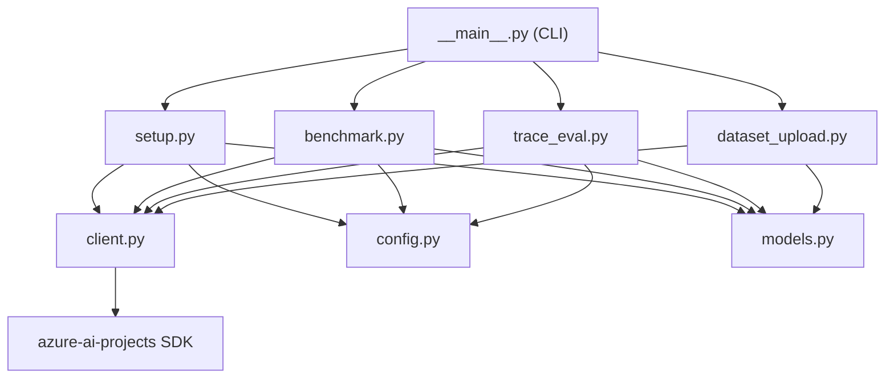
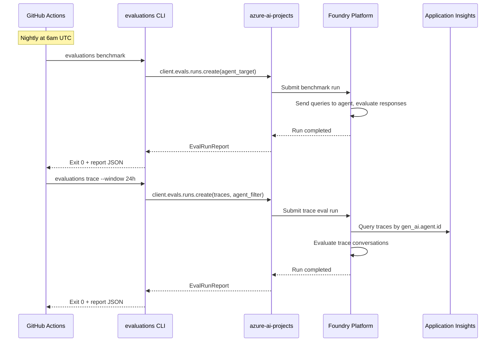

# Implementation Plan: Foundry-Native Multi-Layer Evaluations

**Branch**: `008-foundry-native-evaluations` | **Date**: 2026-05-25 | **Spec**: [spec.md](spec.md)
**Input**: Feature specification from `specs/008-foundry-native-evaluations/spec.md`

## Summary

Replace the legacy replay-against-`/chat` evaluation harness with a comprehensive, multi-layer evaluation strategy built entirely on Microsoft Foundry's native evaluation platform (`azure-ai-projects` >= 2.0.0). Three layers provide complementary coverage: real-time continuous evaluation (`EvaluationRule`), nightly golden-dataset benchmark (Agent Target Evaluation), and nightly production audit (Trace Evaluation). All layers use `client.evals` API surface and produce "Completed" runs in the Foundry portal, enabling Cluster Analysis for failure pattern identification.

## Technical Context

**Language/Version**: Python 3.11+
**Primary Dependencies**: `azure-ai-projects` >= 2.0.0, Pydantic, httpx
**AI Platform**: Azure AI Foundry (evaluation platform, agent registry)
**Observability**: Application Insights (trace source for Layer 3)
**Auth**: DefaultAzureCredential (UAMI on self-hosted runner)
**Testing**: pytest, pytest-asyncio (`uv run poe test`)
**Target Platform**: GitHub Actions self-hosted runner (cadence-private)
**Package Manager**: uv (NOT pip)
**Quality Gate**: `uv run poe check` (required before commit)
**Performance Goals**: Nightly eval jobs complete within 30 minutes total (benchmark + trace combined). Zero HTTP calls to Cadence `/api/chat/stream` from eval harness.
**Constraints**: No new persistent storage (reports to `--out`, datasets in Foundry). Exit 0 on per-row errors; non-zero only for submission-level failures.

## Constitution Check

*GATE: Must pass before Phase 0 research. Re-check after Phase 1 design.*

| Principle | Compliance | Notes |
|-----------|-----------|-------|
| I. Async-First | ✅ PASS | SDK calls are async (`await client.evals.runs.create(...)`). CLI uses `asyncio.run()` at entry. |
| II. Validated Data at Boundaries | ✅ PASS | All config/report data flows through Pydantic models (EvalConfig, EvalRunReport, GoldenDatasetRecord). No raw dicts at boundaries. |
| III. Fully Typed | ✅ PASS | All functions typed. SDK returns typed models. |
| IV. Single-Responsibility | ✅ PASS | Each CLI subcommand maps to one module: `setup.py`, `benchmark.py`, `trace_eval.py`, `dataset_upload.py`. Shared client creation in a utility. |
| V. Automated Quality Gates | ✅ PASS | `uv run poe check` enforced. Tests cover each layer independently. |

**Post-Design Re-Check**: All principles satisfied. No violations requiring justification.

## Project Structure

### Documentation (this feature)

```text
specs/008-foundry-native-evaluations/
├── plan.md              # This file
├── research.md          # Phase 0 — SDK patterns, architecture decisions
├── data-model.md        # Phase 1 — Pydantic model definitions
├── quickstart.md        # Phase 1 — Operator quick reference
├── contracts/
│   └── cli-contract.md  # Phase 1 — CLI interface specification
└── tasks.md             # Phase 2 output (via /speckit.tasks)
```

### Source Code Changes

```text
src/evaluations/                    # Restructured evaluation package
├── __init__.py                     # Package init
├── __main__.py                     # CLI entry point (new subcommand structure)
├── config.py                       # Configuration models (restructured)
├── models.py                       # Pydantic models (restructured)
├── setup.py                        # NEW — continuous evaluation rule management
├── benchmark.py                    # NEW — golden dataset agent target evaluation
├── trace_eval.py                   # NEW — trace-based evaluation
├── dataset_upload.py               # ADAPTED from dataset_provisioner.py
├── client.py                       # NEW — shared AIProjectClient factory
├── analysis.py                     # KEPT — local failure clustering utility
├── data/
│   └── golden_queries.jsonl        # MIGRATED from datasets/cadence-eval-gold-v1.jsonl
└── evaluators/                     # KEPT — custom evaluator prompt references
    ├── __init__.py
    ├── answer_adequacy.py
    ├── clarification_quality.py
    ├── param_extraction.py
    └── sql_safety.py

# REMOVED (FR-019):
# - replay.py
# - runner.py
# - harvest.py
# - inspect_run_status.py
# - refresh_dataset.py
# - datasets/ directory (moved to data/)
```

### Workflow Changes

```text
.github/workflows/
├── eval-nightly.yml                # RESTRUCTURED — removes replay, uses benchmark + trace
└── eval-update-dataset.yml         # ADAPTED — points to new dataset_upload module
```

### Test Structure

```text
tests/unit/
├── test_eval_config.py             # Configuration loading and validation
├── test_eval_models.py             # Model serialization/validation
├── test_eval_benchmark.py          # Benchmark submission (mocked SDK)
├── test_eval_trace.py              # Trace eval submission (mocked SDK)
├── test_eval_setup.py              # Continuous eval rule creation (mocked SDK)
├── test_eval_dataset_upload.py     # Dataset upload (mocked SDK)
└── test_eval_cli.py                # CLI argument parsing and routing
```

## Architecture

### Module Dependency Graph



### Evaluation Flow



## Implementation Approach

### Phase 1: Foundation (config, models, client)

1. Restructure `config.py` — new Pydantic models for all three layers
2. Restructure `models.py` — EvalRunReport, GoldenDatasetRecord
3. Create `client.py` — shared `AIProjectClient` factory with DefaultAzureCredential

### Phase 2: Core Evaluation Modules

1. Create `setup.py` — continuous evaluation rule create/update
2. Create `benchmark.py` — golden dataset agent target evaluation
3. Create `trace_eval.py` — trace-based evaluation with agent-filter and explicit-ids modes

### Phase 3: Dataset and CLI

1. Adapt `dataset_upload.py` — from existing `dataset_provisioner.py`
2. Rewrite `__main__.py` — new subcommand structure (setup, benchmark, trace, dataset upload)
3. Migrate golden dataset — rename fields, move to `data/` directory

### Phase 4: Cleanup and Workflow

1 Remove legacy files — `replay.py`, `runner.py`, `harvest.py`, `inspect_run_status.py`, `refresh_dataset.py`
2 Update `eval-nightly.yml` — remove replay/sleep, add benchmark + trace steps
3 Update `eval-update-dataset.yml` — point to new module path
4 Update `pyproject.toml` — bump `azure-ai-projects` to >= 2.0.0

### Phase 5: Testing

1 Unit tests for each module (mocked SDK calls)
2 CLI integration tests (argument parsing, dry-run mode)
3 Verify `uv run poe check` passes

## Key Design Decisions

| Decision | Rationale |
|----------|-----------|
| No local evaluation fallback | Spec mandates Foundry-native only. Local eval doesn't produce portal-visible runs. |
| Async entry with `asyncio.run()` | Constitution principle I. SDK is async-native. |
| Pydantic for all config/reports | Constitution principle II. Validates at load time. |
| One module per layer | Constitution principle IV. Clear ownership, testable in isolation. |
| `--dry-run` on all subcommands | Operator safety — verify config before costly operations. |
| Keep `analysis.py` | Local clustering still useful for offline triage; doesn't conflict with portal Cluster Analysis. |
| Keep `evaluators/` prompts | Reference material for future custom evaluator registration in Foundry catalog. |

## Risks and Mitigations

| Risk | Impact | Mitigation |
|------|--------|------------|
| Feature 007 not producing `gen_ai.agent.id` spans | Trace eval returns 0 rows | Gating dependency documented; trace eval handles gracefully (exit 0, clear report) |
| `azure-ai-projects` 2.0 API changes before GA | Code breaks | Pin specific version; wrap SDK calls in thin adapter layer |
| Log Analytics Reader RBAC missing | Trace eval permission denied | Fail fast with remediation message; document in quickstart |
| Agent not registered in Foundry project | Benchmark agent target fails | Clear error message naming expected agent; document in quickstart |

## Complexity Tracking

No constitution violations. No complexity justifications required.
